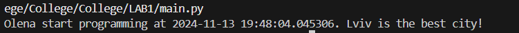
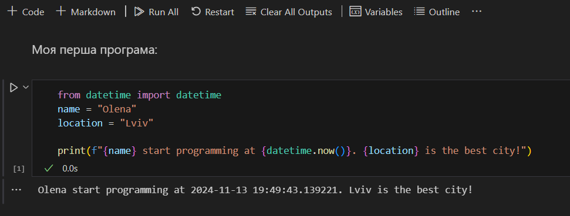

# Лабораторна робота №1
## Тема: оформлення робіт та перша програма
### Мета роботи: налаштувати середовище, створити репозиторій, попрацювати з Markdown та оформити звіт.

---
## Виконання роботи
* ### Результати виконання завдань:
    1. Створила репозиторій та [оформила його](https://github.com/OlenaMizerak/College).
    1. Навчилась працювати із репозиторіями у GitHub та інтегрувати репозиторії з Visual Studio Code.
    1. Написала свою [першу програму Python](./main.py), та успішно запустила її. Програма вивела текст, що буде представлений на скріншоті нижче:
    

    1. Написала свою [другу та третю програми Python](./main.ipynb) та запустила їх. Результати програми будуть представлені на скріншоті нижче:
    

---
## Висновок:
### Отже, у цій роботі мною було створено та оформлено мій репозиторій. Також у цій роботі я ознайомилася із форматуванням Markdown. Також було досягнуто мету роботи: налаштувати середовище, створити репозиторій, попрацювати з Markdown та оформити звіт. Загалом, з цієї лабораторної роботи було отримано такі нові знання, як: робота з Github, форматування Markdown та як створювати та зручно оформлювати репозиторій. Всі завдання виконано, проблем та труднощів це не викликало.
---
⠀⠀⠀⠀