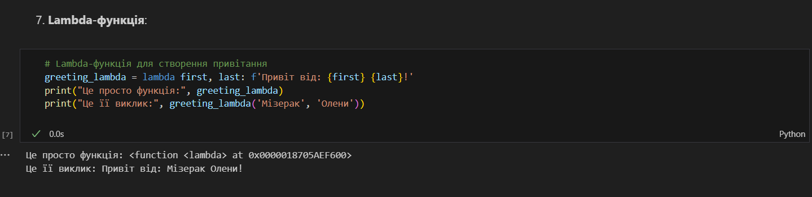

# Лабораторна робота №2
## Тема: Основи програмування на Python  
### Мета роботи: Ознайомитися з основними конструкціями та можливостями Python.

---
## Виконання роботи
* ### Результати виконання завдань:
    1. Створила [файл із базовими прикладами Python-коду](./main.ipynb), у якому відбувається ознайомлення користувача із різними типами даних та основними конструкціями у мові Python.
    1. Попрацювала із циклами `for`, `while`, також ознайомилася із конструкціями `if` та `try-except`.
    1. Використала контекст-менеджер `with` для роботи з файлами у коді Python.
    1. Створила [Lambda-функцію](./main.ipynb) та згодом виконала її:

---
## Висновок:
### Отже, у цій лабораторній роботі мною були виконані ознайомлювальні вправи із конструкціями мови програмування Python. Було досягнуто мету роботи: я ознайомилася з основами Python та отримала практичний досвід роботи з базовими типами даних, циклами, розгалуженнями, обробкою помилок та контекст-менеджерами. Також було отримано знання про різні функції, такі, як, наприклад, lambda-функції.
---
⠀⠀⠀⠀