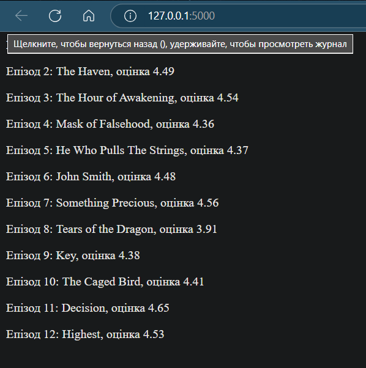

# Звіт до роботи  
## Тема: Робота з віртуальними середовищами та менеджерами пакетів у Python  
### Мета роботи:  
- Ознайомлення з поняттям ізольованих віртуальних середовищ у Python.  
- Встановлення та управління сторонніми бібліотеками за допомогою pip, pipenv та poetry.  
- Навчання створенню та активації віртуальних середовищ, використанню змінних середовища, а також створенню простих програм із застосуванням бібліотек (наприклад, Flask та jikanpy).  

---  
### Виконання роботи

* **Результати виконання завдання 1 – робота з pip та віртуальним середовищем**:  
    1. **Перевірка pip та встановлення бібліотеки:**  
       - Виконали команди `pip -V` та `pip --help` для перевірки встановлення pip і ознайомлення з доступними командами.  
       - Використали команду `pip list` для перегляду встановлених бібліотек та зафіксували вивід.  
       - Встановили бібліотеку requests за допомогою команди:  
         ```bash
         pip install requests
         ```  
       - Запустили Python інтерпретатор та виконали код:
         ```python
         >>> import requests
         >>> r = requests.get('https://google.com')
         >>> print(r.status_code)
         ```
         _Результат:_ отримано статус код 200 (як приклад успішного запиту).  

    2. **Робота з версіями бібліотеки:**  
       - За допомогою команди `pip show requests` перевірили інформацію про пакет.  
       - Встановили конкретну версію бібліотеки:
         ```bash
         pip install requests==2.1
         pip show requests
         ```  
       - Видалили пакет за допомогою:
         ```bash
         pip uninstall requests
         ```  
       - Отримані результати виконання команд були зафіксовані для подальшого включення у звіт.

* **Результати виконання завдання 2 – робота з jikanpy та Flask:**  
    - Розроблено програму, яка отримує інформацію про епізоди аніме за допомогою jikanpy і відображає їх у веб-інтерфейсі:
      ```python
      from flask import Flask, render_template
      from jikanpy import Jikan

      jikan = Jikan()
      app = Flask(__name__)

      j = jikan.anime(54595, extension='episodes')

      @app.route('/')
      def home():
          a = ""
          for episode in j["data"]:
              a += f"<p>Епізод {episode['mal_id']} з назвою: {episode['title']} має оцінку {episode['score']}</p>"
          return a

      @app.route('/about')
      def about():
          return render_template('about.html')

      if __name__ == '__main__':
          app.run(debug=True)
      ```  
    - Програма запущена через команду `python app.py`, після чого було відкрито браузер за адресою [http://127.0.0.1:5000/](http://127.0.0.1:5000/) для перегляду результату.
    - Зафіксовано 

* **Результати виконання завдання 3 – робота з віртуальним середовищем (venv):**  
    1. **Створення та активація середовища:**
       ```bash
       python -m venv ./my_env
       source my_env/Scripts/activate   # для Windows може бути: my_env\Scripts\activate
       ```  
    2. **Встановлення бібліотеки requests:**
       ```bash
       pip install requests
       ```  
    3. **Деактивація середовища та перевірка:**
       ```bash
       deactivate
       pip show requests
       ```  
       _Результат:_ після деактивації віртуального середовища команда `pip show requests` може не показати встановлену бібліотеку, адже вона існує лише у ізольованому середовищі.

* **Результати виконання завдання 4 – робота з Pipenv:**  
    1. **Встановлення Pipenv та перегляд допомоги:**
       ```bash
       pip install pipenv
       pipenv --help
       ```  
       _Зафіксовано перелік доступних команд._  
    2. **Створення нового середовища та встановлення бібліотеки:**
       ```bash
       pipenv --python 3.10
       pipenv --venv
       pipenv run python -V
       pipenv install requests
       ```  
       _Після цього перевірили наявність файлів Pipfile та Pipfile.lock, в яких записані залежності проєкту._  
    3. **Запуск простого скрипта за допомогою Pipenv:**  
       Створено файл `script.py`:
       ```python
       import requests

       response = requests.get('https://httpbin.org/')
       for line in response.iter_lines():
           print(line)
       ```  
       Запуск виконаний наступними командами:
       - Через командну стрічку:
         ```bash
         pipenv run python script.py
         ```  
       - Або увійшовши у середовище:
         ```bash
         pipenv shell
         python script.py
         ```  
       _Результати виконання скрипта були зафіксовані (консольний вивід)._

    4. **Встановлення додаткової бібліотеки:**  
       - Прикладом є бібліотека `colorama`:
         ```bash
         pipenv install colorama
         ```  
       - Приклад коду з використанням:
         ```python
         from colorama import init, Fore, Style
         init()
         print(Fore.RED + "Це червоний текст" + Style.RESET_ALL)
         ```
    5. **Налаштування інтерпретатора у Visual Studio:**  
       - За допомогою команди **Python: Select interpreter** у командній палітрі вибрано створене віртуальне середовище Pipenv.
       - Скрипт запущено через кнопку Run, результати виконання були зафіксовані.

* **Результати виконання завдання 5 – робота зі змінними середовища:**  
    1. **Створення файлу `.env`:**
       ```
       HELLO=Привіт, світ!
       ```  
    2. **Код для перевірки змінної:**
       ```python
       import os
       print(os.environ.get('HELLO'))
       ```  
       _Результат:_ при активації віртуального середовища змінна завантажується автоматично і виводиться значення.  
    3. **Примітка:** Якщо запустити скрипт без активації середовища, змінна не буде доступною (повернеться `None`).

* **Результати виконання завдання 6 – робота з Poetry:**  
    1. **Створення нового проєкту:**
       ```bash
       poetry new myproject
       cd myproject
       ```  
    2. **Ініціалізація та встановлення залежності:**
       ```bash
       poetry init   # якщо проєкт вже існує
       poetry add requests
       ```  
       _Залежність додається у файл `pyproject.toml` і встановлюється у віртуальному середовищі._  
    3. **Перегляд встановлених залежностей:**
       ```bash
       poetry show
       poetry show --tree
       ```  
    4. **Видалення залежності та оновлення:**
       ```bash
       poetry remove <package_name>
       poetry update
       ```  
    5. **Активація середовища та запуск команди:**
       ```bash
       poetry shell
       poetry env list
       poetry env info
       ```  
    6. **Додавання груп пакетів для розробки:**
       ```bash
       poetry add --dev pytest flake8 black isort mypy
       ```  
    7. **Створення програми за допомогою AI (файл `app.py`):**
       ```python
       from flask import Flask
       import requests

       app = Flask(__name__)

       @app.route('/')
       def home():
           response = requests.get('https://httpbin.org/get')
           return f"<h1>Відповідь від httpbin:</h1><pre>{response.text}</pre>"

       if __name__ == '__main__':
           app.run(debug=True)
       ```  
       - Для запуску встановлено Flask:
         ```bash
         poetry add flask
         ```  
       - Програма запущена через:
         ```bash
         poetry shell
         python app.py
         ```  
       - Результати запуску (вивід у браузері) зафіксовано.

* **Вставлені рисунки та результати:**  
    - Використовувалися як URL зразки:
        
    - Та локальні шляхи:
        
    - Також вставлено код та текстові результати виконання:
      ```python
      def simple_function_example():
          pass
      ```  
      ```text
      << Тут можна писати те що хочемо виокремити >>
      ```

* **Результати виконання індивідуального завдання:**  
    - Створено та запущено програму для web-сайту з використанням Flask, що інтегрує попередній код для відображення даних з httpbin.org.

---  
### Висновок:
> **Що зроблено в роботі:**  
- Розроблено послідовність завдань з використанням pip, venv, Pipenv та Poetry для створення ізольованих віртуальних середовищ та управління бібліотеками.  
- Створено кілька простих програм на Python, які демонструють роботу з API, Flask, а також роботу зі змінними середовища.

> **Чи досягнуто мети роботи:**  
- Так, усі завдання виконано, і мета роботи — ознайомлення з інструментами управління середовищем та залежностями в Python — досягнута.

> **Які нові знання отримано:**  
- Отримано практичні навички роботи з pip, створення та активації віртуальних середовищ, використання Pipenv та Poetry для управління залежностями, а також інтеграції Flask і сторонніх API (jikanpy).

> **Чи вдалось відповісти на всі питання, задані в ході роботи:**  
- Так, всі завдання були розглянуті та виконані згідно вимог.

> **Чи вдалося виконати всі завдання:**  
- Так, всі етапи роботи були реалізовані, результати зафіксовані та включені до звіту.

> **Чи виникли складності у виконанні завдання:**  
- Деякі труднощі виникали при роботі з ізоляцією середовища та налаштуванням інтерпретатора у Visual Studio, проте вони були успішно вирішені.

> **Чи подобається такий формат здачі роботи (Feedback):**  
- Формат звіту структурований, що сприяє зрозумілості та наочності виконаних завдань. Він дозволяє детально відобразити процес виконання роботи.

> **Побажання для покращення (Suggestions):**  
- Було б корисно додати більш інтерактивні приклади, а також можливість інтегрувати автоматизовані тести для перевірки виконання завдань.  
- Також можна розширити розділ із демонстрацією роботи з API, надавши більше прикладів використання різних методів запитів.