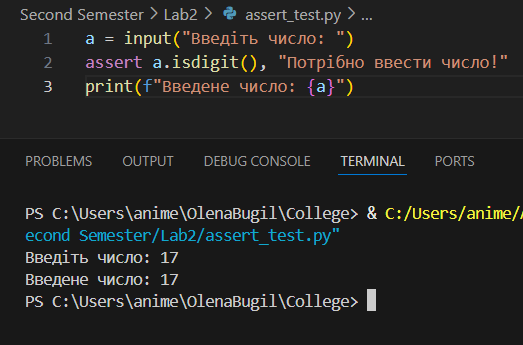
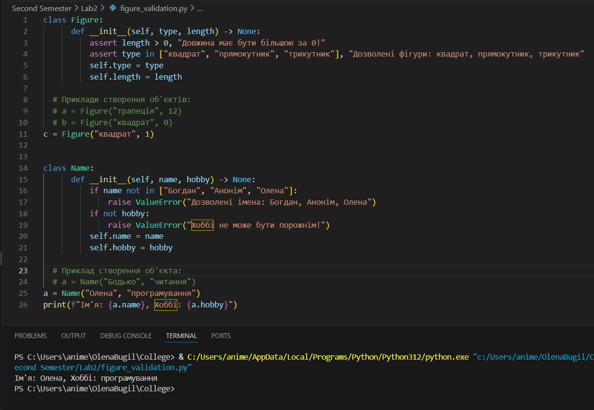
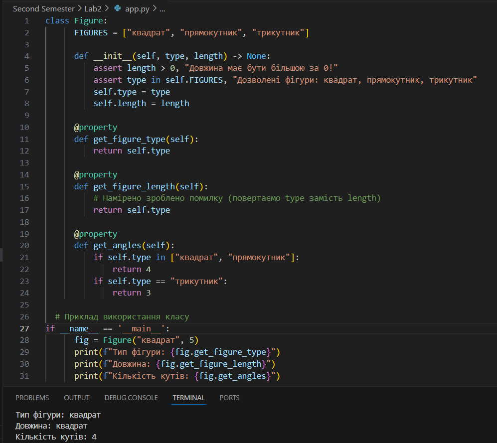
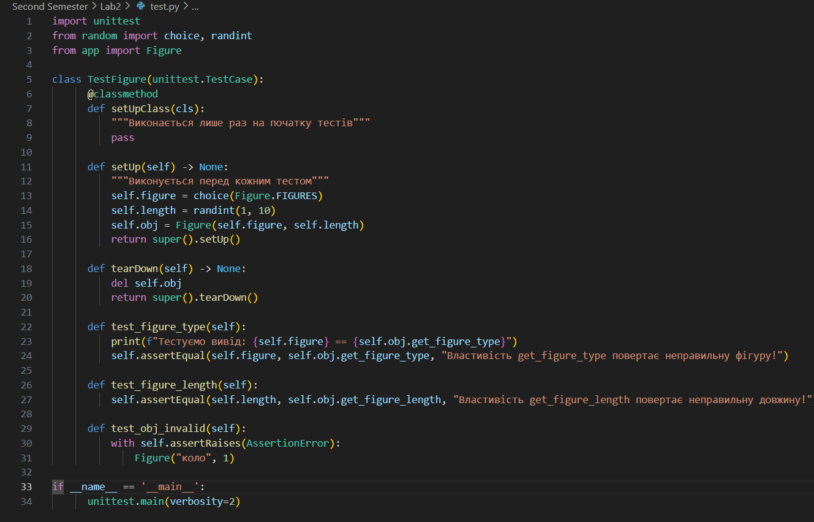
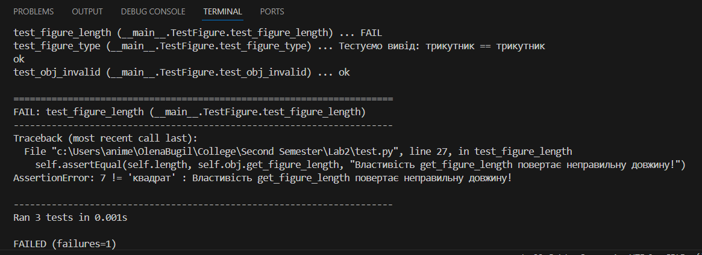
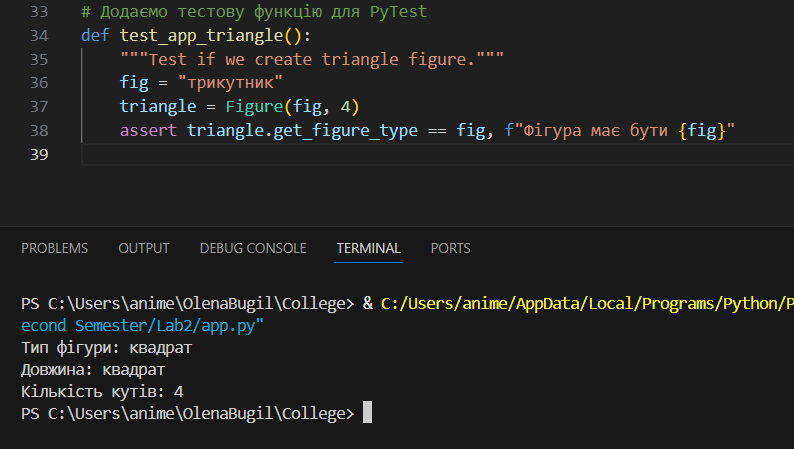

# Звіт до роботи

## Тема: Тестування коду за допомогою assert, unittest та PyTest

### Мета роботи:
- Ознайомлення з методами перевірки коректності роботи коду за допомогою `assert`.
- Реалізація валідації даних під час введення з клавіатури та при створенні об'єктів у класах.
- Створення юніт-тестів із використанням бібліотеки `unittest`.
- Побудова тестів з використанням PyTest, а також аналіз покриття коду (coverage) за допомогою pytest-cov.
- Підготовка звіту з демонстрацією виконання тестів, скріншотів та отриманих результатів.

---

## Виконання роботи

### 1. Перевірка assert
- **Файл:** `assert_test.py`
- **Зміст:**  
  Скрипт приймає введення користувача через `input`, перевіряє, чи є введене число за допомогою assert, та виводить результат.  


### 2. Валідація у класах
- **Файл:** `figure_validation.py`
- **Зміст:**  
  Скрипт містить два класи:  
  - **Figure** – перевіряє тип фігури та її довжину через assert.  
  - **Name** – перевіряє, чи входить ім'я до дозволеного списку; додаємо також перевірку на непорожнє хоббі.  


### 3. Юніт тести з використанням unittest
- **Файл:** `app.py`
- **Зміст:**  
  Скрипт містить клас **Figure** з помилковою реалізацією одного з getter-ів для демонстрації тестування, а також реалізовані властивості, метод для отримання кутів та приклади використання.

  
- **Файл:** `test.py`
- **Зміст:**  
  Файл містить юніт тести для класу **Figure** із використанням бібліотеки `unittest`.



### 4. Юніт тест з використанням PyTest
- **Файл:** `app.py`(розширено)
- **Зміст:**  


* **Результати виконання індивідуального завдання:**  
### 1. Перевірка `assert`
1. Створила файл **`assert_test.py`**, в якому використала `assert` для перевірки введення чисел з клавіатури.
2. Випробувала різні сценарії введення (числа, нечислові дані), щоб переконатися, що перевірка працює коректно.

### 2. Валідація у класах
1. Створила файл **`figure_validation.py`** з класом **Figure**, який перевіряє тип фігури та її довжину.
2. Додала клас **Name** з перевіркою імені та хобі. У разі невірного введення (неприпустиме ім’я або порожнє хобі) генерується виняток `ValueError`.
3. Перевірила роботу цих класів із різними вхідними даними.

### 3. Юніт-тести з використанням `unittest`
1. Створила файл **`app.py`** з класом **Figure**, де навмисно допущено помилку в геттері довжини.
2. Створила файл **`test.py`** із тестовим класом **TestFigure**, де використовуються методи `unittest` для перевірки:
   - Коректності типу фігури;
   - Коректності довжини фігури;
   - Виникнення помилки при недозволених параметрах.
3. Запустила тести через:
   ```bash
   python -m unittest discover